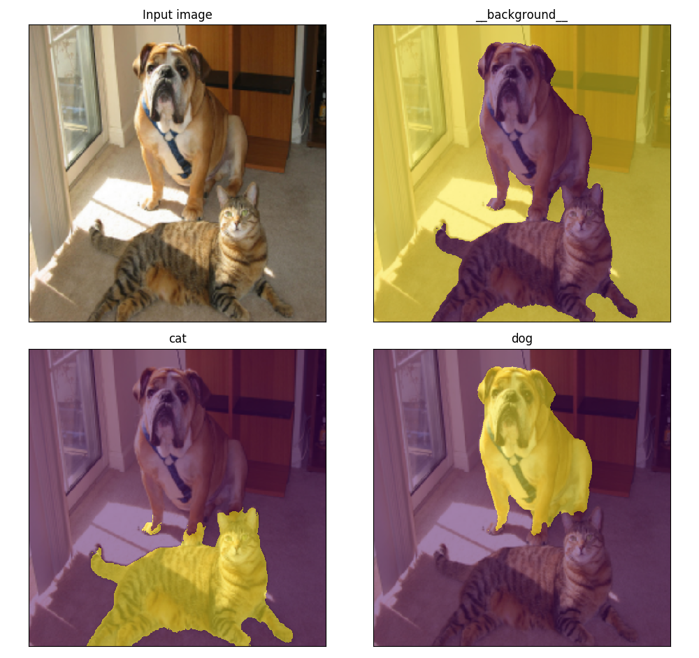

# PSPNet with PyTorch

PyTorch implementation of Pyramid Scene Parsing Network (https://arxiv.org/abs/1612.01105). This repo is just for *Caffe to PyTorch* model conversion and inference.

### Requirements

* PyTorch
* click
* pydensecrf
* protobuf

## Model Conversion
Instead of building the author's caffe implementation, you can convert off-the-shelf caffemodels to PyTorch models via only the ```caffe.proto```.

### 1. Compile the ```.proto``` file for Python API
*NOTE: This step can be skipped. FYI.*<br>
Download [the author's ```caffe.proto```](https://github.com/hszhao/PSPNet/blob/master/src/caffe/proto/caffe.proto), not the one in the original caffe.
```sh
# For protoc command
pip install protobuf
# This generates ./caffe_pb2.py
protoc --python_out=. caffe.proto
```

### 2. Download caffemodels

Find on [the author's page](https://github.com/hszhao/PSPNet#usage) (e.g. pspnet50_ADE20K.caffemodel) and store to the ```data/models/``` directory.

### 3. Convert

Convert the caffemodels to ```.pth``` file

```sh
python convert.py --dataset [ade20k|voc12|cityscape]
```

## Inference

```sh
python demo.py --dataset [ade20k|voc12|cityscape] --image <path to image>
```
* With a ```--no-cuda``` option, this runs on CPU.
* With a ```--crf``` option, you can perform a CRF postprocessing.



## References

* Official implementation: https://github.com/hszhao/PSPNet
* Chainer implementation: https://github.com/mitmul/chainer-pspnet